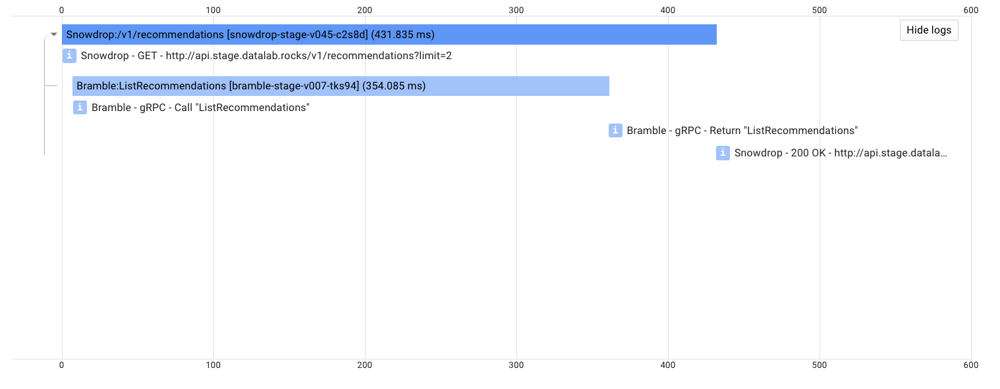

# Stackdriver Logging
> Adds distributed tracing information to logger output and sends traces to the Stackdriver Trace API.

# todo tw firebreak sprint:
- add examples for exceptions too
- finish readme for flask helpers
- write tests for b3/tracing stuff
- code grpc helpers
- write readme for it

## Purpose

Make it simple to generate and propagate tracing metadata between Python microservices.
The package has three core functions:
1. Add a handler to the `root` logger that writes log entries into `stdout` in JSON, which 
[Stackdriver Logs](https://cloud.google.com/logging/) can parse.

2. Decorate each log entry with tracing metadata: `span id` and `trace id`.

3. Send tracing metadata to the [Stackdriver Trace API](https://cloud.google.com/trace/). 

## Motivation
This setup is useful when working with containers in Google Kubernetes Engine with logging enabled 
[(more info)](https://cloud.google.com/kubernetes-engine/docs/how-to/logging). 

With logging enabled in the Kubernetes cluster, anything written to `stdout`/`stderr` by a container is parsed by a 
[fluentd daemon](https://github.com/GoogleCloudPlatform/fluent-plugin-google-cloud) and sent to the Stackdriver Logs API. 
If the log entries are written in JSON, then the daemon can process [certain fields](https://cloud.google.com/logging/docs/agent/configuration#special_fields_in_structured_payloads) 
in the entry, any fields not recognised are thrown into a `jsonPayload` field. <sup>*</sup> The logging handler added by this package 
writes the logs in JSON using [python-json-logger](https://github.com/madzak/python-json-logger), and adds extra metadata which Stackdriver Logs expects.


Two important pieces of metadata added are the `span id` and the `trace id` using code from [B3-Propagation](https://github.com/davidcarboni/B3-Propagation). These parameters make it possible to trace 
requests across different services, this approach is described in more detail in the 
[openzipkin/b3-propagation](https://github.com/openzipkin/b3-propagation) repository. 


The Stackdriver Trace API exists separate to the Logging API, meaning that unfortunately the Trace API cannot pull the trace IDs 
from the logs. Instead, these have to be posted separately. This package does this using Google's [google-cloud-trace](https://pypi.org/project/google-cloud-trace/)
Python client. Calls to this can be quite slow, so they are made in a new thread to ensure no blocking. Traces can be viewed in the
Trace API and they are linked to the logs by tracing metadata as shown below.




## Usage
### Initial setup
- Install `pip install git+https://github.com/bbc/python-gcp-trace-logging@BRANCH/COMMIT_HASH/TAG_NAME`.
- You must provide authentication for the client to be able to access the Stackdriver Trace API. This is achievable on your __local__ machine 
by running `gcloud auth application-default login`. You will likely get a warning when running a service saying to use a 
`service account` instead of `end user credentials` - this is fine to ignore as long as your application is not firing off 
excessive amounts of logs. When running in __GKE__, these details should be picked up __automatically__.
### JSON Logger
To use the Stackdriver-compliant JSON logs, run the `configure_json_logging` function before using any loggers.
This will add a new handler to the root logger which writes logs in JSON. This only needs to be run once in your application
and must be called with the Google Cloud Platform project name.
```
import logging 
from gcptracelogging.jsonlog import configure_json_logging`

configure_json_logging('gcp-project-name')
logger = logging.getLogger('app')
```

### Stackdriver Trace
To create a span and post the parameters to the Stackdriver Trace API use the `start_span` and `end_span` functions.

```python
from gcptracelogging.tracing import start_span, end_span, TracedSubSpan`

# http
start_span(request.headers, 'http', request.path, 'http://localhost:5000')
do_stuff()
end_span()
# grpc
start_span(request.b3_values, 'grpc', 'demoFunc', 'http://localhost:50055')
do_stuff()
end_span()
```
These should be run before and after a request is handled.
The logger will add the span ID and the trace ID to log entries, always write log entries inside a span or else they wont 
be linked to a span. Passing in the headers/values from an upstream request allows any tracing IDs from an upstream call to be picked up and used. 
In the example, decorators are used to handle span creation.

When making a downstream call, a subspan should be created using the `TracedSubSpan()` context manager and the tracing 
parameters should be sent with the call. 
```python
# http
with TracedSubSpan() as b3_headers:
    requests.get('http://example.com', headers=b3_headers)

# grpc
with TracedSubSpan() as b3_headers:
    message = DemoMessage(
        b3_values=b3_headers,
        ...
    )
    stub.DemoRPC(message)
```

### Example
See example usage with a Flask app and a gRPC app in the `examples/` directory. Output from running:
```
{"severity": "INFO", "time": "2018-07-13T11:42:23.351930", "logging.googleapis.com/trace": "projects/bbc-connected-data/traces/None", "logging.googleapis.com/spanId": null, "logging.googleapis.com/sourceLocation": {"file": "run_examples.py", "line": 36, "function": "run_flask_examples"}, "message": "demoLogger - Single call to Flask root endpoint:"}
{"severity": "INFO", "time": "2018-07-13T11:42:23.391907", "logging.googleapis.com/trace": "projects/bbc-connected-data/traces/e1db00af516331bca0de4164d58b1e5a", "logging.googleapis.com/spanId": "eeb175f1c9217011", "logging.googleapis.com/sourceLocation": {"file": "flask_server.py", "line": 29, "function": "before"}, "message": "demoFlaskLogger - GET - http://localhost:5005/"}
{"severity": "INFO", "time": "2018-07-13T11:42:23.393741", "logging.googleapis.com/trace": "projects/bbc-connected-data/traces/e1db00af516331bca0de4164d58b1e5a", "logging.googleapis.com/spanId": "eeb175f1c9217011", "logging.googleapis.com/sourceLocation": {"file": "flask_server.py", "line": 33, "function": "after"}, "message": "demoFlaskLogger - 200 OK - http://localhost:5005/"}
{"severity": "INFO", "time": "2018-07-13T11:42:23.403557", "logging.googleapis.com/trace": "projects/bbc-connected-data/traces/None", "logging.googleapis.com/spanId": null, "logging.googleapis.com/sourceLocation": {"file": "run_examples.py", "line": 38, "function": "run_flask_examples"}, "message": "demoLogger - Done"}

{"severity": "INFO", "time": "2018-07-13T11:42:23.404075", "logging.googleapis.com/trace": "projects/bbc-connected-data/traces/None", "logging.googleapis.com/spanId": null, "logging.googleapis.com/sourceLocation": {"file": "run_examples.py", "line": 41, "function": "run_flask_examples"}, "message": "demoLogger - Double call to Flask endpoints:"}
{"severity": "INFO", "time": "2018-07-13T11:42:23.419749", "logging.googleapis.com/trace": "projects/bbc-connected-data/traces/6f9b00dc34a5184c24dc2de3735760c3", "logging.googleapis.com/spanId": "8ab9f588d6bd3cc1", "logging.googleapis.com/sourceLocation": {"file": "flask_server.py", "line": 29, "function": "before"}, "message": "demoFlaskLogger - GET - http://localhost:5005/doublehttp"}
{"severity": "INFO", "time": "2018-07-13T11:42:23.450904", "logging.googleapis.com/trace": "projects/bbc-connected-data/traces/6f9b00dc34a5184c24dc2de3735760c3", "logging.googleapis.com/spanId": "f20682c50cd39631", "logging.googleapis.com/sourceLocation": {"file": "flask_server.py", "line": 29, "function": "before"}, "message": "demoFlaskLogger - GET - http://localhost:5005/"}
{"severity": "INFO", "time": "2018-07-13T11:42:23.452522", "logging.googleapis.com/trace": "projects/bbc-connected-data/traces/6f9b00dc34a5184c24dc2de3735760c3", "logging.googleapis.com/spanId": "f20682c50cd39631", "logging.googleapis.com/sourceLocation": {"file": "flask_server.py", "line": 33, "function": "after"}, "message": "demoFlaskLogger - 200 OK - http://localhost:5005/"}
{"severity": "INFO", "time": "2018-07-13T11:42:23.462686", "logging.googleapis.com/trace": "projects/bbc-connected-data/traces/6f9b00dc34a5184c24dc2de3735760c3", "logging.googleapis.com/spanId": "8ab9f588d6bd3cc1", "logging.googleapis.com/sourceLocation": {"file": "flask_server.py", "line": 33, "function": "after"}, "message": "demoFlaskLogger - 200 OK - http://localhost:5005/doublehttp"}
{"severity": "INFO", "time": "2018-07-13T11:42:23.476191", "logging.googleapis.com/trace": "projects/bbc-connected-data/traces/None", "logging.googleapis.com/spanId": null, "logging.googleapis.com/sourceLocation": {"file": "run_examples.py", "line": 43, "function": "run_flask_examples"}, "message": "demoLogger - Done"}
{"severity": "INFO", "time": "2018-07-13T11:42:23.536611", "logging.googleapis.com/trace": "projects/bbc-connected-data/traces/None", "logging.googleapis.com/spanId": null, "logging.googleapis.com/sourceLocation": {"file": "grpc_server.py", "line": 40, "function": "create_server"}, "message": "demoGRPCLogger - Starting gRPC server on http://localhost:50055."}

{"severity": "INFO", "time": "2018-07-13T11:42:24.489285", "logging.googleapis.com/trace": "projects/bbc-connected-data/traces/None", "logging.googleapis.com/spanId": null, "logging.googleapis.com/sourceLocation": {"file": "run_examples.py", "line": 52, "function": "run_grpc_examples"}, "message": "demoLogger - Call to gRPC endpoint:"}
{"severity": "INFO", "time": "2018-07-13T11:42:24.495645", "logging.googleapis.com/trace": "projects/bbc-connected-data/traces/ba5263941155313b5514007959c7459a", "logging.googleapis.com/spanId": "d8f1a0354c67ba92", "logging.googleapis.com/sourceLocation": {"file": "grpc_server.py", "line": 20, "function": "wrapper"}, "message": "demoGRPCLogger - gRPC - Call DemoRPC"}
{"severity": "INFO", "time": "2018-07-13T11:42:24.496377", "logging.googleapis.com/trace": "projects/bbc-connected-data/traces/ba5263941155313b5514007959c7459a", "logging.googleapis.com/spanId": "d8f1a0354c67ba92", "logging.googleapis.com/sourceLocation": {"file": "grpc_server.py", "line": 22, "function": "wrapper"}, "message": "demoGRPCLogger - gRPC - Return DemoRPC"}

{"severity": "INFO", "time": "2018-07-13T11:42:24.508794", "logging.googleapis.com/trace": "projects/bbc-connected-data/traces/None", "logging.googleapis.com/spanId": null, "logging.googleapis.com/sourceLocation": {"file": "run_examples.py", "line": 57, "function": "run_grpc_examples"}, "message": "demoLogger - Call to Flask endpoint that calls gRPC endpoint:"}
{"severity": "INFO", "time": "2018-07-13T11:42:24.521839", "logging.googleapis.com/trace": "projects/bbc-connected-data/traces/ce7eb34172a2c95ce6f881d899da5b0c", "logging.googleapis.com/spanId": "d7ce930b52ee85af", "logging.googleapis.com/sourceLocation": {"file": "flask_server.py", "line": 29, "function": "before"}, "message": "demoFlaskLogger - GET - http://localhost:5005/grpc"}
{"severity": "INFO", "time": "2018-07-13T11:42:24.527182", "logging.googleapis.com/trace": "projects/bbc-connected-data/traces/ce7eb34172a2c95ce6f881d899da5b0c", "logging.googleapis.com/spanId": "e38e715fe74fdfd2", "logging.googleapis.com/sourceLocation": {"file": "grpc_server.py", "line": 20, "function": "wrapper"}, "message": "demoGRPCLogger - gRPC - Call DemoRPC"}
{"severity": "INFO", "time": "2018-07-13T11:42:24.527777", "logging.googleapis.com/trace": "projects/bbc-connected-data/traces/ce7eb34172a2c95ce6f881d899da5b0c", "logging.googleapis.com/spanId": "e38e715fe74fdfd2", "logging.googleapis.com/sourceLocation": {"file": "grpc_server.py", "line": 22, "function": "wrapper"}, "message": "demoGRPCLogger - gRPC - Return DemoRPC"}
{"severity": "INFO", "time": "2018-07-13T11:42:24.539340", "logging.googleapis.com/trace": "projects/bbc-connected-data/traces/ce7eb34172a2c95ce6f881d899da5b0c", "logging.googleapis.com/spanId": "d7ce930b52ee85af", "logging.googleapis.com/sourceLocation": {"file": "flask_server.py", "line": 33, "function": "after"}, "message": "demoFlaskLogger - 200 OK - http://localhost:5005/grpc"}
{"severity": "INFO", "time": "2018-07-13T11:42:24.550120", "logging.googleapis.com/trace": "projects/bbc-connected-data/traces/None", "logging.googleapis.com/spanId": null, "logging.googleapis.com/sourceLocation": {"file": "run_examples.py", "line": 59, "function": "run_grpc_examples"}, "message": "demoLogger - Done"}
```


## Notes
\* Some fields may not be parsed as expected, this is likely due to the version of the 
[fluentd plugin](https://github.com/GoogleCloudPlatform/fluent-plugin-google-cloud) not being the latest. 
For example, the `logging.googleapis.com/span_id` field is only supported in more recent versions of the plugin.
