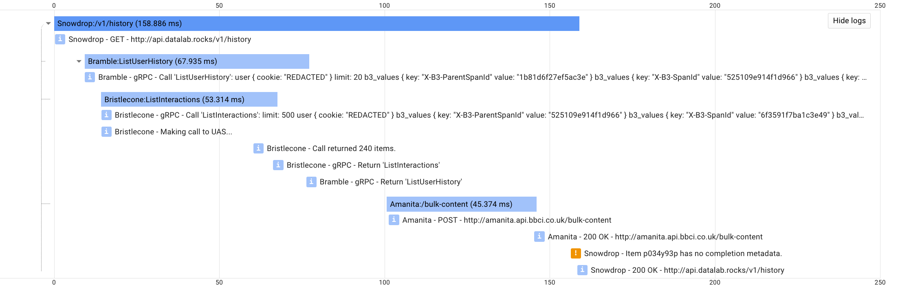

# Log Tracer

> Adds distributed tracing information to logger output and sends traces to the Stackdriver Trace API.


## Usage
### Pre Setup
Install: `pip install git+https://github.com/bbc/logtracer@[BRANCH or COMMIT_HASH or TAG_NAME]`.
It is good practice to pin the version or your code may break if this package is updated.

### JSON Logging 
Before any logs are written, a `JSONLoggingFactory` instance must be created. This is used to manage logging, with optional tracing, across the package.

```python
# app/log.py
from logtracer.jsonlog import JSONLoggerFactory, Formatters
import os 

project_name = 'bbc-connected-data'
service_name = 'demoApp'

logging_format = os.getenv('LOGGING_FORMAT', 'local')
logger_factory = JSONLoggerFactory(project_name, service_name, Formatters[logging_format], logger_per_module=False)
# or without env variable
# logger_factory = JSONLoggerFactory(project_name, service_name, Formatters.local)
logger = logger_factory.get_logger(__name__)
logger.setLevel('DEBUG')
```
Initialise this, as above, _once_ in your app. You may need to initialise it in a separate file to prevent cyclic import errors.
Eg. the above could be contained in `log.py` and across your app you can use:
```python
from app.log import logger_factory

logger = logger_factory.get_logger(__name__)
```
If `logger_per_module` is `True` in the `JSONLoggerFactory` initialisation, then a logger will created with the name `<service_name>.<__name__>`,
if `False` then it will re-use the service-wide logger `<service_name>`.
### JSON Logging in Stackdriver Format
To format the JSON logs in such a way that Stackdriver Logs can understand, pass in `stackdriver` as the `logging_format`.
it is recommended you do this using an environmental variable as above.

### Tracing 
By default tracing functionality is disabled, you may use the logging functionality without any tracing functionality.

There are four ways to implement tracing, depending on your use case:
#### `Tracer` class
See [Tracer](logtracer/tracing). This is the main tracing class - the `FlaskTracer`, `GRPCTracer` and `MixedTracer` classes inherit from the this class.
Usually you don't want to use this class directly, use one of the others instead.
   
#### `MixedTracer` class
See [MixedTracer](logtracer/helpers/mixed), use with a Flask app that calls gRPC or HTTP services. Inherits from both
`GRPCTracer` and `FlaskTracer`.

#### `FlaskTracer` class
See [FlaskTracer](logtracer/helpers/flask), use with a Flask app that calls other HTTP services.

#### `GRPCTracer` class
See [GRPCTracer](logtracer/helpers/grpc), use with a gRPC app that calls other gRPC or HTTP services.

#### Stackdriver Trace API
To enable posting of traces, the `post_spans_to_stackdriver_api` argument passed into the `Tracer` instance initialisation must be `True`, and the `logging_format` argument passed into the `JSONLoggerfactory` instance initialisation must be `stackdriver` enum. If `post_spans_to_stackdriver_api` is `True`, and GCP Credentials are not found, an exception will be raised.

If you are deploying a an image onto a Kubernetes cluster, then GCP credentials should be retrieved automatically, **unless you have set up another service account to be used**. In this case, make sure to **add the relevant roles to the service account**. The enviromental variables above **must be set** to post traces, do this using a Kubernetes `configmap` (we use the `stackdriver-logging` configmap already configured in the `bbc-connected-data` project, add this to the deployment in `Spinnaker`).

If you choose to enable posting trace information to the API  _locally_ (unadvised unless you are specifically testing functionality of the Trace API or need to see traces of a local process), 
then you *must* set up authentication for the [google-cloud-trace](https://pypi.org/project/google-cloud-trace/) client.

If no dedicated service account is set up with the service, then use the following command: 
```
gcloud auth application-default login
```
However, if you have configured another service account then make sure to **add the relevant roles to the service account**.

## Purpose

Make it simple to generate and propagate tracing metadata between Python microservices and post them to a tracing API.
Package functionality can be separated into two areas, logging and tracing.

### Logging

Using the logging part of this package allows logs to be written in `JSON` format. The logging handler added by this package 
writes the logs in JSON using [python-json-logger](https://github.com/madzak/python-json-logger). Currently two formatters are implemented,
`local` and `stackdriver`. Examples of each:

#### `local`
```
{"severity": "INFO", "time": "2018-07-25T14:06:05.499727", "sourceLocation": {"file": "/Users/windet01/Files/Code/logtracer/logtracer/flask_helpers/decorators.py", "line": 21, "function": "wrapper"}, "message": "demoApp - GET - http://localhost:5010/", "traceId": "854a7fbec6f0c912f6745b514a2ae6ee", "spanID": "231d2786b123764e"}
```
This formatter simply prints the log information to stdout in JSON, with some added fields.

#### `stackdriver`
```
{"severity": "INFO", "time": "2018-07-25T14:06:09.949433", "logging.googleapis.com/sourceLocation": {"file": "/Users/windet01/Files/Code/logtracer/logtracer/flask_helpers/callbacks.py", "line": 17, "function": "execute_before_request"}, "message": "demoApp - GET - http://localhost:5005/", "logging.googleapis.com/trace": "projects/bbc-connected-data/traces/89f78ff01d84e130a43f2461dddb996f", "logging.googleapis.com/spanId": "d259b23ab3d81bdd"}
```
This format prints the information to stdout in JSON, with keys named in a way that [Stackdriver Logs](https://cloud.google.com/logging/) is able to parse them.
The `stackdriver` formatter is useful when working with containers in Google Kubernetes Engine with logging enabled 
[(more info)](https://cloud.google.com/kubernetes-engine/docs/how-to/logging). 

With logging enabled in the Kubernetes cluster, anything written to `stdout`/`stderr` by a container is parsed by a 
[fluentd daemon](https://github.com/GoogleCloudPlatform/fluent-plugin-google-cloud) and sent to the Stackdriver Logs API. 
If the log entries are written in JSON, then the daemon can process [certain fields](https://cloud.google.com/logging/docs/agent/configuration#special_fields_in_structured_payloads) 
in the entry, any fields not recognised are thrown into a `jsonPayload` field. <sup>*</sup> 


### Tracing
Two important pieces of metadata dealt with by this module are the `span id` and the `trace id` (using code adapted from [B3-Propagation](https://github.com/davidcarboni/B3-Propagation)). 
These parameters make it possible to trace requests across different services, an approach described in more detail in the 
[openzipkin/b3-propagation](https://github.com/openzipkin/b3-propagation) repository. 

These IDs are included in the JSON logs if present and omitted if not. 
The span details are also posted to the [Stackdriver Trace API](https://cloud.google.com/trace/), this functionality is *disabled* by default. 
The Trace API exists separate to the Logging API, meaning that unfortunately the Trace API cannot pull the trace information 
from the logs. Instead, these have to be posted separately. This package does this using Google's [google-cloud-trace](https://pypi.org/project/google-cloud-trace/)
Python client. Calls to this are not of negligible time, so they are made in a new thread to ensure requests are not blocked. Traces can be viewed in the
Trace API and they are linked to the logs by tracing metadata as shown in the image below.



_New in version 0.3.4_: Trace and span IDs are now picked up from headers received from a GCP load balancer.


## Examples
Examples for a Flask and a gRPC service exist in the [examples](logtracer/examples) directory.

```bash
python -m logtracer.examples.<flask or grpc or mixed>.server
# in a separate bash environment with server still running
python -m logtracer.examples.<flask or grpc or mixed>.client
```
By default these examples will have logging levels as `INFO` and will attempt to post to the Trace API using the `bbc-connected-data` GCP credentials.
If your account does not have access to this project or you haven't run the [authentication command](#stackdriver-trace-api) then the examples will fail. 
You may clone the examples and change logging levels to `DEBUG` for more verbosity or pass `post_spans_to_stackdriver_api=False` in to the `Tracer` initialisations to disable posting the spans to the Trace API.  

## Notes
\* Some fields may not be parsed as expected, this is likely due to the version of the 
[fluentd plugin](https://github.com/GoogleCloudPlatform/fluent-plugin-google-cloud) not being the latest. 
For example, the `logging.googleapis.com/span_id` field is only supported in more recent versions of the plugin.

